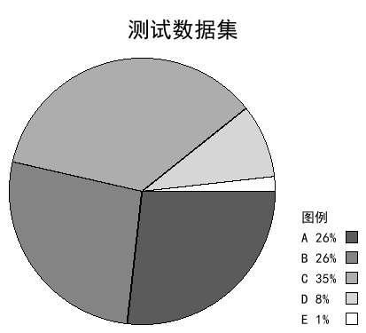

# pillowPieslice

使用Pillow生成饼状图的简单例子

通过Pillow模块自动生成饼状图的小栗子。具体的说明请参考[自制基于Pillow的饼状图生成类](https://0w0.in/2022/08/zzjypdbztscl/)

值得注意的是，本程序 *不* 包含开发所需的字体文件，而是直接调用了C盘下的simhei字体。 *你一定是有这个字体的吧！*

## 食用方法

- 本地运行

前往 release 页面下载文件，解压后执行：`python3 pieslice.py` ,然后程序就会在当前目录生成一张 `tmp.png`。

生成别的数据的饼状图请直接修改文件里的内容就可以。

感谢 *[Avimitin](https://github.com/Avimitin)* 提供的这个README文件模板。

如有错误或不恰当的地方，欢迎您到上述文章评论指正，或给我发送私信。
